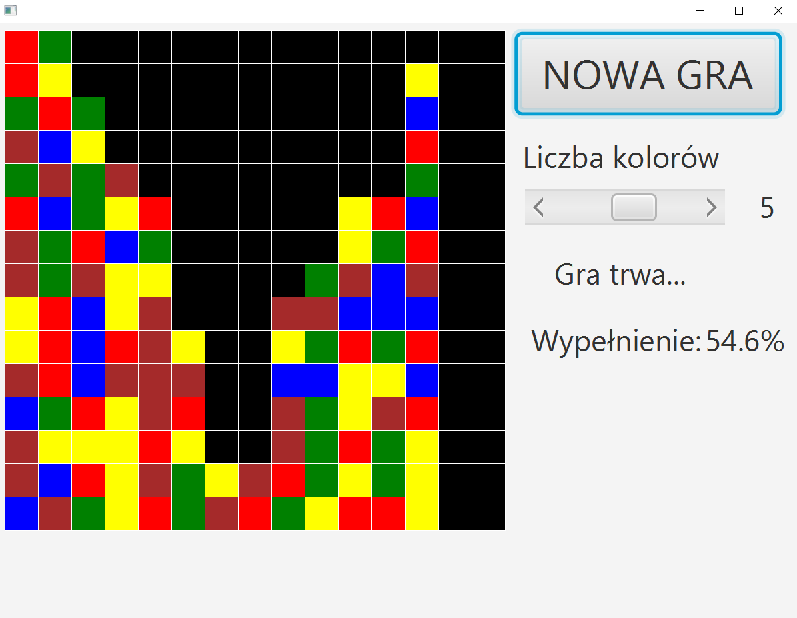
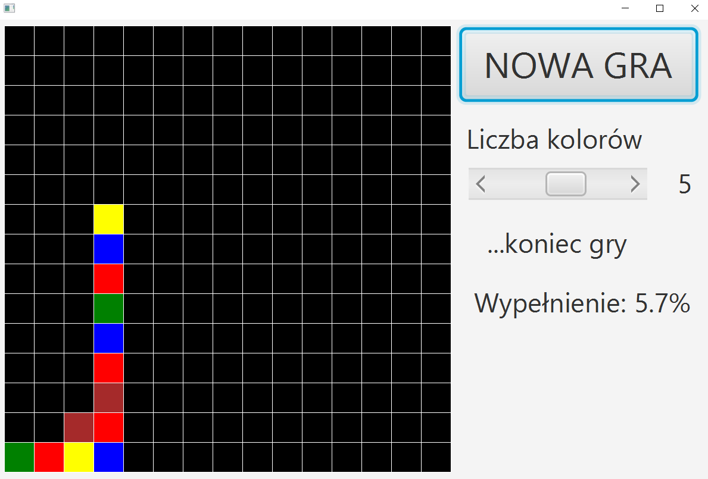

# Znikające Kwadraty

## General info
This project was a part of my 9 months java course. It takes one week time.
## Used technologies
- Java 8
- JavaFX
## Screenshots
Algorithm that removes group of the same colour squares works nice correctly.
